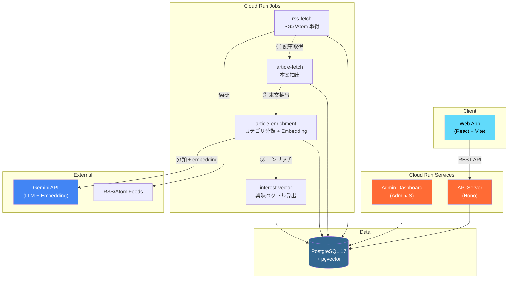
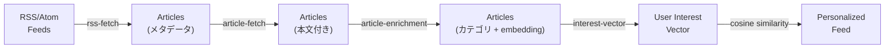

# Curio

AI-powered Personalized Curation Platform.
「情報の洪水」から高価値なインサイトを抽出する、パーソナライズド・キュレーションアプリ。

## Architecture



### Data Pipeline



### Interaction Model

ユーザーの行動（SKIP / LIKE / OPEN / READ）から興味ベクトルを算出し、記事の embedding とのコサイン類似度でパーソナライズドフィードを生成。

```
SKIP  → 左スワイプ（弱い負のシグナル）
LIKE  → 右スワイプ（強い正のシグナル）
OPEN  → 記事タップ（中程度の正のシグナル）
READ  → 読了（強い正のシグナル）
```

## Tech Stack

| Layer | Technology | Location |
| :--- | :--- | :--- |
| **Frontend** | React 19 + Vite + TanStack Router | `apps/web/` |
| **Backend** | [Hono](https://hono.dev/) (Cloud Run) | `apps/api/` |
| **Admin** | [AdminJS](https://adminjs.co/) + Express | `apps/admin/` |
| **Jobs** | Cloud Run Jobs (バッチ処理) | `apps/jobs/` |
| **Database** | PostgreSQL 17 + [pgvector](https://github.com/pgvector/pgvector) | `apps/packages/database/` |
| **ORM** | [Prisma 7](https://www.prisma.io/) | |
| **AI/ML** | Gemini API (分類 + Embedding) | |
| **Auth** | [Better Auth](https://www.better-auth.com/) | |
| **Infra** | Terraform (GCP) | `infra/` |
| **Package Manager** | pnpm 10 (Workspaces) | |
| **Linter/Formatter** | [Biome](https://biomejs.dev/) | |
| **Testing** | [Vitest](https://vitest.dev/) | |

## Directory Structure

```
.
├── apps/                          # pnpm Monorepo
│   ├── api/                       # Backend API (Hono)
│   ├── web/                       # Frontend (React + Vite)
│   ├── admin/                     # Admin Dashboard (AdminJS)
│   ├── jobs/                      # バッチジョブ (Cloud Run Jobs)
│   └── packages/
│       ├── database/              # Prisma + pgvector
│       └── shared/                # 共有型定義（予約）
│
├── infra/                         # Terraform (GCP)
│   ├── cloudbuild/                # Cloud Build 設定
│   ├── cloudrun/                  # Cloud Run ジョブ定義
│   └── environment/               # Terraform モジュール
│
├── docs/                          # 設計ドキュメント
├── scripts/                       # ユーティリティスクリプト
├── compose.yaml                   # ローカル開発用 PostgreSQL
└── README.md
```

詳細は [docs/directory_structure.md](docs/directory_structure.md) を参照。

## Quick Start

```bash
# 1. Start PostgreSQL with pgvector
docker compose up -d

# 2. Install dependencies
cd apps
pnpm install

# 3. Run migrations
pnpm db:migrate

# 4. Seed data (optional)
pnpm --filter @curio/database db:seed

# 5. Start development servers
pnpm --filter @curio/api dev      # API: http://localhost:3001
pnpm --filter @curio/web dev      # Web: http://localhost:5173
pnpm --filter @curio/admin dev    # Admin: http://localhost:3002
```

## Packages

| Package | Description |
| :--- | :--- |
| [`@curio/api`](apps/api/) | Hono ベースの REST API サーバー |
| [`@curio/web`](apps/web/) | React フロントエンド（スワイプ UI） |
| [`@curio/admin`](apps/admin/) | AdminJS 管理画面 |
| [`@curio/jobs`](apps/jobs/) | バッチ処理ジョブ群 |
| [`@curio/database`](apps/packages/database/) | Prisma スキーマ・クライアント |

## Documentation

- [Product Spec](docs/product_spec.md)
- [Directory Structure](docs/directory_structure.md)
- [Database Package](apps/packages/database/README.md)
