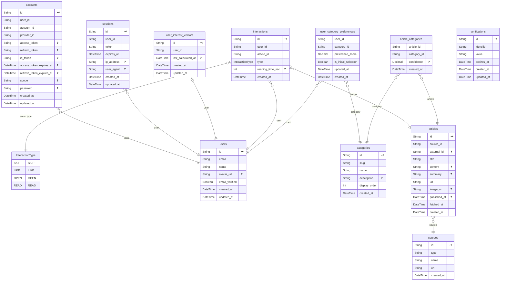

```mermaid
erDiagram

        InteractionType {
            SKIP SKIP
LIKE LIKE
OPEN OPEN
READ READ
        }
    
  "users" {
    String id "🗝️"
    String email 
    String name 
    String avatar_url "❓"
    Boolean email_verified 
    DateTime created_at 
    DateTime updated_at 
    }
  

  "sources" {
    String id "🗝️"
    String type 
    String name 
    String url 
    DateTime created_at 
    }
  

  "categories" {
    String id "🗝️"
    String slug 
    String name 
    String description "❓"
    Int display_order 
    DateTime created_at 
    }
  

  "articles" {
    String id "🗝️"
    String source_id 
    String external_id "❓"
    String title 
    String content "❓"
    String summary "❓"
    String url 
    String image_url "❓"
    DateTime published_at "❓"
    DateTime fetched_at 
    DateTime created_at 
    }
  

  "article_categories" {
    String article_id 
    String category_id 
    Decimal confidence "❓"
    DateTime created_at 
    }
  

  "user_category_preferences" {
    String user_id 
    String category_id 
    Decimal preference_score 
    Boolean is_initial_selection 
    DateTime updated_at 
    DateTime created_at 
    }
  

  "interactions" {
    String id "🗝️"
    String user_id 
    String article_id 
    InteractionType type 
    Int reading_time_sec "❓"
    DateTime created_at 
    }
  

  "user_interest_vectors" {
    String id "🗝️"
    String user_id 
    DateTime last_calculated_at "❓"
    DateTime created_at 
    DateTime updated_at 
    }
  

  "sessions" {
    String id "🗝️"
    String user_id 
    String token 
    DateTime expires_at 
    String ip_address "❓"
    String user_agent "❓"
    DateTime created_at 
    DateTime updated_at 
    }
  

  "accounts" {
    String id "🗝️"
    String user_id 
    String account_id 
    String provider_id 
    String access_token "❓"
    String refresh_token "❓"
    String id_token "❓"
    DateTime access_token_expires_at "❓"
    DateTime refresh_token_expires_at "❓"
    String scope "❓"
    String password "❓"
    DateTime created_at 
    DateTime updated_at 
    }
  

  "verifications" {
    String id "🗝️"
    String identifier 
    String value 
    DateTime expires_at 
    DateTime created_at 
    DateTime updated_at 
    }
  
    "articles" }o--|| sources : "source"
    "article_categories" }o--|| articles : "article"
    "article_categories" }o--|| categories : "category"
    "user_category_preferences" }o--|| users : "user"
    "user_category_preferences" }o--|| categories : "category"
    "interactions" |o--|| "InteractionType" : "enum:type"
    "interactions" }o--|| users : "user"
    "interactions" }o--|| articles : "article"
    "user_interest_vectors" |o--|| users : "user"
    "sessions" }o--|| users : "user"
    "accounts" }o--|| users : "user"
```
